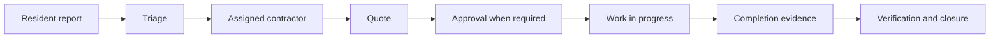

# Fort Knox | Property Command Center

### Your entire property portfolio. One command center.

**Know what is happening. Know what it costs. Know who did it.**

Property Command Center connects rent, tenants, maintenance, contractors, expenses, security and evidence into one operational history. It is built for owners who want to understand their buildings without being physically present at every one of them.

> You don't need to be everywhere. You just need to be connected to everything that matters.


*Concept imagery from the public product experience. Product demonstrations use illustrative data.*

[Explore the product](#what-the-command-center-connects) · [Control and Fort Knox](#two-levels-of-command) · [Run locally](#run-locally) · [Project status](#project-status) · [Documentation](#documentation)

## The idea

A property creates information every day: rent arrives, a unit becomes vacant, a tenant reports a leak, a contractor sends a quote, a camera records an event.

Too often, that information lives in separate places. Payments are in a spreadsheet. Repair photos are in WhatsApp. The quotation is on somebody's phone. CCTV is on another system. The owner becomes the person who calls everyone to reconstruct what happened.

**Stop managing your properties from WhatsApp. Start commanding them from one system.**

The Command Center gives each event a home: a property, building, floor, unit, tenancy and responsible person. A maintenance request can lead to a quote, an approval, an expense and completion evidence. An overdue balance belongs to an identifiable tenancy. Camera activity can connect to an incident and its audit trail.

That connection is the product: **a command center for your bricks and mortar.**

| The daily question | The operational answer |
| --- | --- |
| Which tenants still owe rent? | Expected charges, payments, allocations and outstanding balances. |
| Why is this repair costing so much? | The quote, contractor, approval, repair history and supporting evidence. |
| Did the work actually happen? | Status changes, photographs, verification and a timestamped history. |
| What is an empty unit costing me? | Vacancy duration and estimated rent opportunity. |
| Who accessed the cameras? | Scoped camera permissions and surveillance access records. |
| What needs my attention today? | A prioritized view of approvals, financial exposure and operational exceptions. |

## What the Command Center connects

### Money you can account for

Follow expected rent through payments, allocations, balances and arrears. Review service charges, expenses and maintenance expenditure alongside property performance. Payment integrations include M-Pesa STK Push and Paystack, with server-side confirmation and reconciliation.

The goal is straightforward: see what should have arrived, what arrived, and what needs follow-up.

### Maintenance with a chain of responsibility

A resident reports a problem with photos or video. The request stays attached to the correct unit as staff triage it, assign a contractor, review a quotation, obtain approval and verify the completed work.



Configurable spending policies decide which repairs can proceed and which require the owner's decision. The quote and its evidence travel with that decision.

### A memory for every unit

The Digital Property Passport brings tenancy, inspection, maintenance, asset and document records into the context of the property. History remains useful after a tenant moves out or a member of staff changes.

### Security connected to operations

The security architecture connects authorized camera access, events, incidents and evidence through a browser-compatible streaming gateway. Viewing, playback and sensitive evidence actions are governed by permissions and auditing.

CCTV requires a configured gateway and compatible site infrastructure. Hardware, installation, networking and storage are separate deployment considerations.

### Attention where it matters

Portfolio summaries, Property Health, intelligence signals and the Action Queue help owners spot overdue work, arrears, vacancy and unusual expenditure. Signals support human decisions and link operations back to their records; they are not guarantees of returns or crime prevention.

## One operation, different responsibilities

| Workspace | What it is built around |
| --- | --- |
| **Landlord / owner** | Authorized portfolio, financial visibility, approvals, performance and security oversight. |
| **Property manager** | Assigned properties, resident operations, maintenance, contractors and permitted financial work. |
| **Caretaker** | Assigned buildings, daily field work, inspections, incidents and resident service. |
| **Tenant** | A mobile-first workspace for their own tenancy, rent, receipts, documents and maintenance requests. |
| **Contractor** | Assigned jobs, quotations, progress, work evidence and invoices. |
| **Super admin** | Organizations, roles, subscriptions, integrations and audited platform operations. |

Tenant onboarding starts with a staff-created assignment. After phone verification, the resident is bound to the assigned tenancy. **The tenant does not choose or change their unit.**

Backend authorization combines role, permission, organization membership, resource scope, ownership, feature entitlement and resource state. A hidden button is never the security boundary.

## Two levels of command

The repository is named **Fort Knox**. The product is **Property Command Center**, with two product tiers described in the specification:

| Control | Fort Knox |
| --- | --- |
| Operational and financial organization | Remote operational and security command |
| Properties, buildings and units | Everything in Control |
| Tenants and tenancies | CCTV integration and camera permissions |
| Rent, arrears and expenses | Motion events and incident workflows |
| Maintenance and contractors | Surveillance auditing and evidence workflows |
| Documents, notifications and reporting | Advanced alerts and property intelligence |
| Property Health and role-based access | Executive Action Queue and deeper oversight |

Availability is governed by configured entitlements and deployment readiness. Pricing depends on portfolio size and integration scope; this repository does not publish a binding price list.

## Who this is for

Apartment owners, multi-property landlords, developers, estate managers, commercial and mixed-use property owners, property-management companies and institutional owners.

It is especially useful when visiting every building no longer scales, staff updates are difficult to verify, rent records are fragmented, or security and maintenance operate in isolation.

## Project status

**Active development with working role workspaces, backend domain modules and a public product experience.** This repository includes production configuration checks, automated tests, CI and container definitions. It is not a claim that every deployment is ready to handle live customer money or security operations.

Real adapters exist for M-Pesa, Paystack, Twilio, SendGrid, S3-compatible storage and an HTTPS CCTV gateway. Paystack hosts rent and recurring subscription checkout; billing access starts only after a verified payment event. They require provider accounts, credentials and deployment testing. Per-landlord M-Pesa merchant settlement needs further implementation; current Daraja merchant configuration is deployment-wide.

Crypto checkout/reconciliation, Cloudinary delivery, push notifications, generic SMTP, malware scanning and a complete announcements workflow remain incomplete. Some secondary workspace actions still require service integration. The landing-page demo form now saves leads through the sales API. Gmail follow-up, Google Sheets synchronization and Drive document storage are not implemented by the CRM metadata on those records. The landlord onboarding agreement checkbox is not yet a persisted signed contract; prepaid checkout and delayed provider renewal still require staging acceptance.

See the [production readiness runbook](docs/PRODUCTION_READINESS.md) for integration gaps and owner setup tasks, and the [execution tracker](docs/CODEX_EXECUTION_TRACKER.md) for implementation and verification history.

## Built for accountable operations

- Organization and property scope are enforced on the backend.
- Phone/OTP authentication includes expiry, attempt limits and session controls.
- Payment confirmation comes from verified provider interactions, not frontend assertions.
- Maintenance transitions and sensitive actions leave audit records.
- Sensitive files use controlled storage access; camera credentials stay out of the browser.
- Development role previews are isolated from production authorization.

Read the [security specification](docs/SECURITY.md) and [CCTV architecture](docs/CCTV_ARCHITECTURE.md) for the design and deployment requirements behind these controls.

## Technology and structure

| Layer | Stack |
| --- | --- |
| Frontend | Next.js, React, TypeScript, Tailwind CSS, reusable shadcn-style UI components, Motion, Lucide and Recharts |
| API | Node.js, Express, TypeScript and Zod |
| Data | MongoDB and Mongoose |
| Verification | Vitest, Supertest, ESLint, TypeScript and GitHub Actions |
| Deployment | Separate API, background worker and frontend container services |

```text
apps/
  backend/       API, domain services, authorization, integrations and jobs
  frontend/      Public product experience and role workspaces
docs/            Product, architecture, security and delivery specifications
infrastructure/  Reference production deployment
.github/         Automated quality workflow
```

## Run locally

Use Node.js 22 or a compatible newer version, npm, and a running MongoDB instance. Use a replica set for workflows that require transactions.

```bash
git clone https://github.com/HillaryMurimi/Fort-Knox.git
cd Fort-Knox
npm --prefix apps/backend ci
npm --prefix apps/frontend ci
```

Create `apps/backend/.env` from `apps/backend/.env.example` and `apps/frontend/.env.local` from `apps/frontend/.env.example`. Configure MongoDB and use different local JWT secrets. Environment files are excluded from Git; provider secrets belong only on the backend.

Run each service in a separate terminal:

```bash
npm --prefix apps/backend run dev
```

```bash
npm --prefix apps/frontend run dev
```

```bash
npm --prefix apps/backend run jobs:worker
```

The frontend defaults to **http://localhost:3000** and the API to **http://localhost:9000/api/v1**. The public experience is at `/`, authentication at `/login`, and the development screen directory at `/dev/preview`.

For local UI previews, configure the explicitly named development flags in the frontend example environment file. Keep them disabled in production. Previewing a role never grants backend permissions.

RBAC, billing and super-admin seed commands are available in `apps/backend/package.json`. Review their inputs and the environment before running them against a database.

## Quality and deployment

Run the repository checks from the root:

```bash
npm run typecheck
npm run lint
npm test
npm run build
npm run certify:release
```

`npm run verify:production` runs the combined workspace gate. Static certification is one part of verification, not a substitute for staging acceptance or live-provider testing.

The intended host is Coolify. Use the [Coolify deployment guide](docs/COOLIFY_DEPLOYMENT.md) and its [Compose definition](docker-compose.coolify.yml) for the API, worker and frontend. Follow the [production runbook](docs/PRODUCTION_READINESS.md) for HTTPS, provider callbacks, database backups, storage, monitoring and deployment secrets. The [reference Compose deployment](infrastructure/docker-compose.production.yml) is for non-Coolify setups.

## Documentation

| Read this | For |
| --- | --- |
| [Master context](docs/MASTER_CONTEXT.md) | Product vision, operating principles and tier direction |
| [Features](docs/FEATURES.md) | Domain capabilities and workflows |
| [Roles and permissions](docs/ROLES_PERMISSIONS.md) | Who can do what, and within which scope |
| [Architecture](docs/ARCHITECTURE.md) | System boundaries and engineering patterns |
| [Database design](docs/DATABASE_DESIGN.md) | Resource models and persistence |
| [API specification](docs/API_SPECIFICATION.md) | Backend contracts |
| [Testing strategy](docs/TESTING_STRATEGY.md) | Verification and security coverage |
| [Development roadmap](docs/DEVELOPMENT_ROADMAP.md) | Delivery phases |
| [Execution tracker](docs/CODEX_EXECUTION_TRACKER.md) | Current implementation and remaining work |

For product feedback or technical discussion, [open an issue](https://github.com/HillaryMurimi/Fort-Knox/issues). Before changing code, read [AGENTS.md](AGENTS.md) and the relevant domain specifications.

---

**Your property is too valuable to manage blind.**

Connect the people, money, work and evidence behind it.
